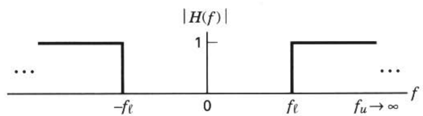
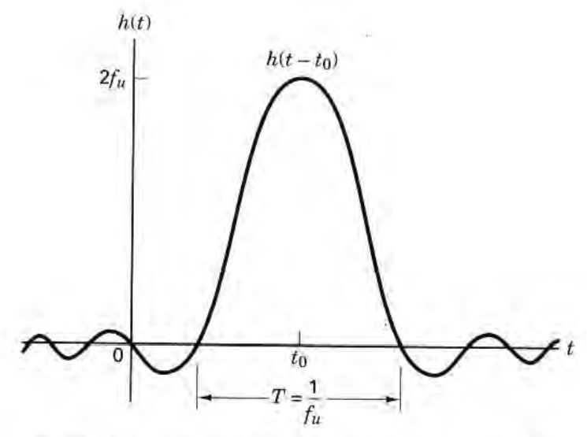
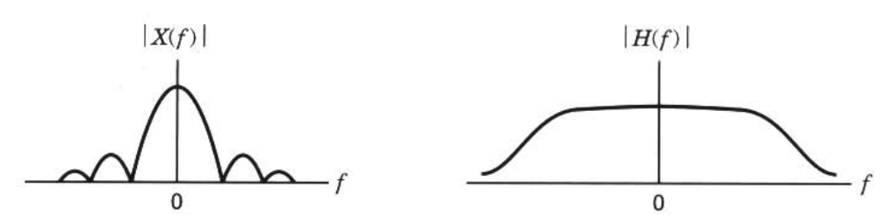
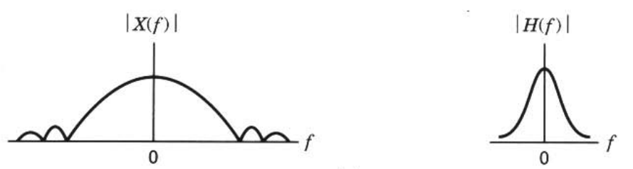
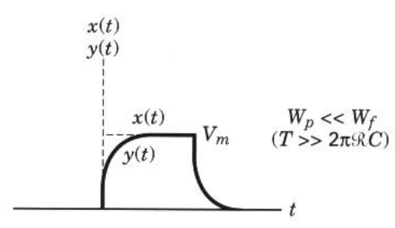
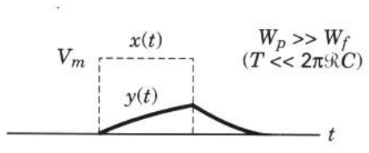

<!-- ## Objective

- [x] What is relation between signal transmission and linear systems

--- -->

## Introduction

- what are the characterization of systems
- what are their effects on such signals and noise
- the system is assumed to be linear and time invariant
- there is no stored energy in the system at the time the input is applied

---

## Impulse Response

It is response when the input is equal to a unit impulse $\delta(t)$

$$
h(t)=y(t)\quad\text{when }x(t)=\delta(t)
$$

- Characterizing a linear system in terms of its impulse response has a straightforward physical interpretation

The response of the network to an arbitrary input signal $x(t)$

$$
y(t)=x(t)*h(t)=\int^{\infty}_{-\infty}x(\tau)h(t-\tau)d\tau
$$

---

### Causal

No output prior to the time, $t=0$, when the input is applied

$$
y(t)=x(t)*h(t)=\int^{\infty}_{0}x(\tau)h(t-\tau)d\tau
$$

---

## Frequency Transfer Function

Convolution in the frequency domain

$$
Y(f)=X(f)H(F)
$$

$$
H(f)={Y(f)\over{X(f)}}
$$

The Fourier transform of the impulse response function

$$
H(f)=\mathscr{F}\{h(t)\}
$$

---

$$
H(f)=|H(f)|e^{j\theta(f)}
$$

- $|H(f)|$: the magnitude response
- $\theta(f)=\tan^{-1}{\text{Im}\{H(f)\}\over{\text{Re}\{H(f)\}}}$: the phase response
  - $\text{Re}$: the real part of
  - $\text{Im}$: the imaginary part of

---

Measurment of the frequency transfer function

- input: a sinusoidal generator
- output: an oscilloscope

The input waveform

$$
x(t)=A\cos{2\pi f_0t}
$$

The output

$$
y(t)=A|H(f_0)|\cos{[2\pi f_0t+\theta(f_0)]}
$$

---

### Random Processes and Linear Systems

<!-- > What is relation between random processes and linear systems -->

$$
G_Y(f)=G_X(f)|H(f)|^2
$$

- A time-invariant linear system
  - input $\rightarrow$ output
  - random process $\rightarrow$ random process
  - sample function $\rightarrow$ sample function
  - power spectral density $\rightarrow$ power spectral density

---

## Distortionless Transmission

<!-- > Why does we consider distorionless?
> What is advantage when transmission is distorionless?
> What is condition for distortionless? -->

The output signal, for ideal distortionless transmission

$$
y(t)=Kx(t-t_0)
$$

1. time delay
2. different amplitude (scale change)
3. no distorion

The Fourier transform of the output signal

$$
Y(f)=KX(f)e^{-j2\pi ft_0}
$$

System transfer function

$$
H(f)=Ke^{-j2\pi ft_0}
$$

---

### How to achieve?

- the overall system response must have **a constant magnitude response**
- **its phase shift** must be **linear with frequency**

- all of the signal's frequency components must also arrive with **identical time delay** in order to add up correctly
  - **phase shift** must be **proportional to frequency** in order for the time delay of all components to be identical

$$
t_0\text{ (seconds)}={\theta\text{ (radians)}\over{2\pi f\text{ (radians/second)}}}
$$

---

### What purpose to use?

- measure delay distortion of a siganl
  - envelope delay or group delay

$$
\tau(f)=-{1\over{2\pi}}{d\theta(f)\over{df}}
$$

- way of characterizing phase to be a linear function of frequency
  - to characterize the envelope delay as a constant

---

### Ideal Filter

<!-- > what is ideal filter -->

One cannot build the ideal network

$$
H(f)=Ke^{-j2\pi ft_0}
$$

- problem
  - an infinite bandwidth capacity
- an approximation to the ideal infinite bandwidth network
  - A truncated network that passes, without distortion, all frequency components between $f_l$ and $f_u$
    - $f_l$: the lower cutoff frequency
    - $f_u$: the upper cutoff frequency

---

#### Passband filter

Outside the range $f_l<f<f_u$

#### Bandpass filter (BPF)

$f_l\neq0 \text{ and } f_u\neq\infty$

---

#### Low-pass filter (LPF)

$f_l=0 \text{ and } f_u$ has a finite value

---

#### Hight-pass filter (HPF)

$f_l$ has a nonzero value and $f_u\rightarrow\infty$

---

#### Ideal low-pass filter

- Transfer function

$$
H(f)=|H(f)|e^{-j\theta(f)}
$$

- Impulse response

$$
\begin{split}
h(t)=\mathscr{F}^{-1}\{H(f)\}&=\int^\infty_{-\infty}H(f)e^{j2\pi ft}df\\
% &=\int^{f_u}_{-f_u}e^{-j2\pi ft_0}e^{j2\pi ft}df\\
% &=\int^{f_u}_{-f_u}e^{j2\pi f(t-t_0)}df\\
&=2f_u{\sin{2\pi f_u(t-t_0)}\over{2\pi f_u(t-t_0)}}\\
&=2f_u\text{sinc}{2f_u(t-t_0)}
\end{split}
$$

---

- Noncausal
  - Not relizable

---

### Realizable Filters

<!-- - [ ] What is relation with ideal filter
  - [ ] approximations to the ideal low-pass filter characteristic
    - [ ] the Butterworth filter
- [ ] What does we know from the example
  - [ ] real practical example: RC filter

--- -->

#### RC filter

The very simplest example of a realizable low-pass filter

##### Transfer function

$$
H(f)={1\over{1+j2\pi f\mathscr{R}C}}={1\over{\sqrt{1+(2\pi f\mathscr{R}C)^2}}}e^{-j\theta(f)}
$$

- $\theta(f)=\tan^{-1}{2\pi f\mathscr{R}C}$
- verify that the half-power point of the low-pass RC filter corresponds to $\omega=1/\mathscr{R}C$ radians per second or $f=1/(2\pi \mathscr{R}C)$ hertz

---

- Magnitude characteristic of the RC filter

---

- Phase characteristic of the RC filter

---

##### Bandwidth

- half-power point
  - this point is the frequency at which the output signal power has fallen to one-half of its peak value
  - the frequency at which the magnitude of the output voltage has fallen to $1/\sqrt{2}$ of its peak value

$$
\text{number of dB}=10\log_{10}{P_2\over{P_1}}=10\log_{10}{V^2_2/\mathscr{R}_2\over{V^2_1/\mathscr{R}_1}}
$$

---

- For communication systems
  - normalized power is generally used for analysis
  - $\mathscr{R}_1$ and $\mathscr{R}_2$ are set equal to 1 $\Omega$

$$
\text{number of dB}=10\log_{10}{P_2\over{P_1}}=10\log_{10}{V^2_2\over{V^2_1}}
$$

- The amplitude response in decibels

$$
|H(f)|_{\text{dB}}=20\log_{10}{V_2\over{V_1}}=20\log_{10}{|H(f)|}
$$

---

#### The Butterworth filter

useful approximations to the ideal low-pass filter characteristic

$$
|H_n(f)|={1\over{\sqrt{1+(f/f_u)^{2n}}}}
$$

- as $n$ gets larger, the magnitude characteristics approach that of the ideal filter

---

## Signals, Circuits, and Spectra

How is a signal's bandwidth affected as a result of the signal passing through a filter circuit?

---

The output signal spectrum constrained by the input signal spectrum alone

---

The bandwidth of the output signal constrained by the filter bandwidth

---

The effect of a filter on a waveform from view in the time domain

$$
y(t)=
\begin{cases}
  V_m(1-e^{-t/\mathscr{R}C})&\quad\text{for } 0\leq t\leq T\\
  V_m^{'}e^{-(t-T)/\mathscr{R}C}&\quad\text{for } t>T
\end{cases}
$$

- $V_m^{'}=V_m(1-e^{-T/\mathscr{R}C})$

The pulse bandwidth

$$
W_p={1\over{T}}
$$

$\mathscr{R}C$ filter bandwidth

$$
W_f={1\over{2\pi \mathscr{R}C}}
$$

---

The ideal input pulse $x(t)$

---

Magnitude spectrum of the ideal input pulse $|X(f)|$

---

Good-fidelity ouput

- Good approximation of the input pulse $x(t)$

---

Good-recognition output

- Recognition of the pulse transmitted from the output $y(t)$

---

Poor-recognition output

