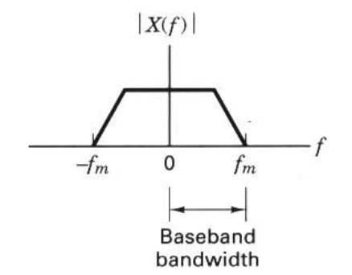
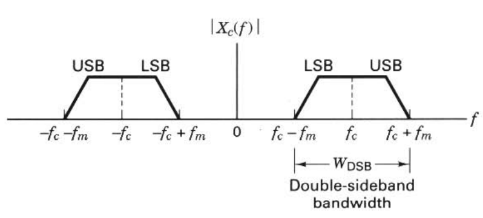

<!-- ## Preview

- What is relation between bandwidth and digital data
- What does we know from baseband versus bandpass
- When does we use filter of them?
- What is dilemma

--- -->

## Baseband versus Bandpass

Way to translate the spectrum of a low-pass or baseband signal $x(t)$ to higher frequency

- multiply or heterodyne the baseband signal with a carrier wave $\cos{2\pi f_ct}$
- The resulting waveform: Double-sideband (DSB) modulated signal

---

Double-sideband (DSB) modulated signal

$$
x_c(t)=x(t)\cos{2\pi f_ct}
$$

- The spectrum of the DSB signal $x_c(t)$

$$
X_c(f)={1\over{2}}{\left[X(f-f_c)+X(f+f_c)\right]}
$$

- $f_m$: baseband signal's bandwidth

---

Baseband sepctrum

---

- The upper sideband (USB)
- The lower sideband (LSB)
- The carrier wave
  - $f_c>>f_m$
  - $W_{DSB}=2f_m$

---

## The Bandwidth Dilemma

### Strictly bandlimited channels

- no signal power whatever is allowed outisde the defined band
- the mathematical description of a real signal does not permit the signal tob estrictly duration limited and strictly bandlimited.
  - the mathematical models are abstractions
