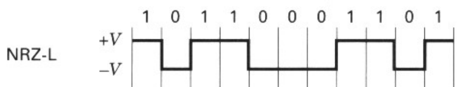
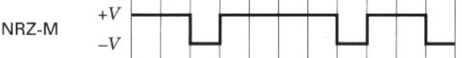
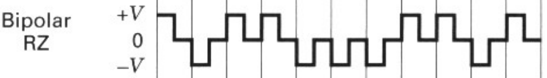
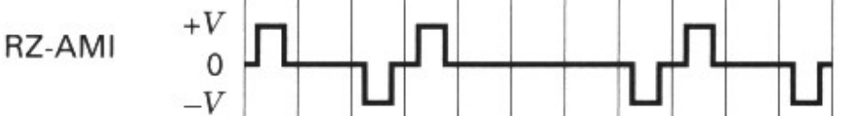
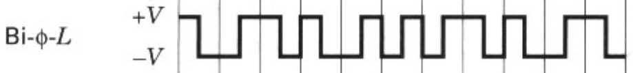
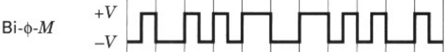
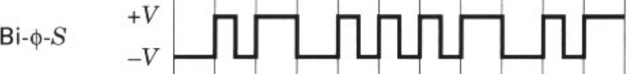
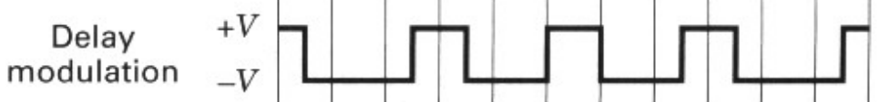
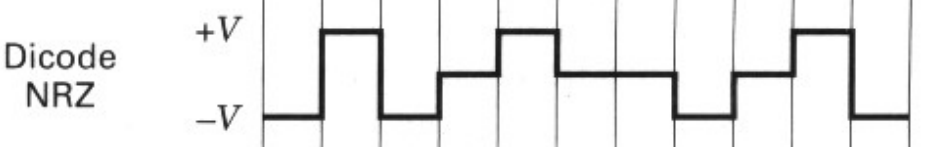
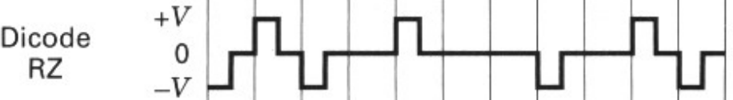

---
# MARP
marp: true
math: katex
paginate: true
backgroundColor: #fff
theme: marp-custom
# Jekyll
title: 2.8 Baseband Transmission
description: ""
categories:
  - Digital Communications
toc: true
toc_sticky: true
tags:
  - [Sklar, Formatting and Baseband Modulation, Baseband Transmission]
date: 2023-02-20
last_modified_at: 2023-02-21
published: true
---

## 2.8.1 Waveform Representation of Binary Digits

- physical
  - electrical pulse in order to transmit them through a baseband channel

---

## 2.8.2 PCM Waveform Types

### Baseband Signaling

- Pulse-code modulation (PCM) waveform
  - The resulting binary waveform when pulse modulation is applied to a binary symbol
    - in telephony applications, line codes
- M-ary pulse-modulation waveform
  - The resulting waveform when pulse modulation is applied to a nonbinary symbol

---

### PCM waveforms groups

#### Nonreturn-to-zero (NRZ)

- NRZ-L (L for level)
  - used in digital logic circuits
  - there is a change in level whenever the data change froma one to zero or from a zero to a one

---

- NRZ-M (M for mark)
  - the one, or mark is represented by a change in level
  - the zero, or space is represented by no change in level
  - differential encoding
  - used in magnetic tape recording
  - 10110001101

---

- NRZ-S (S for space)
  - the complement of NRZ-M
  - one is represented by no change in level
  - zero is represented by a change in level
  - 10110001101

---

#### Return-to-zero (RZ)

application in baseband data transmission and in magnetic recoding

- Unipolar-RZ
  - one is represented by a half-bit-wide puse
  - zero is represented by the absence of a pulse
  - 10110001101

---

- Bipolar-RZ
  - ones and zeros are represented by opposite-level pulse that are one-half bit wide
  - 10110001101

---

- RZ-AMI (alternate mark inversion)
  - a signaling scheme used in telephone systems
  - ones are represented by equal-amplitude alternating pulses
  - zeros are represented by the absence of pulses
  - 10110001101

---

#### Phase encoded

- used
  - Magnetic recoding systems and optical communications
  - Some satellite telemetry links

---

- Bi-phase-level
  - Manchester coding
  - One is represented by a half-bt-wide pulse positioned during the first half of the bit interval
  - A zero is represented by a half-bit-wide pulse positioned during the second half of the bit interval
  - 10110001101

---

- Bi-phase-mark
  - a transition occurs at the beginning of every bit interval
  - a one is represented by a second transition one-half bit interval later
  - a zero is represented by no second transition
  - 10110001101

---

- Bi-phase-space
  - A transition also occurs at the beginning of ebery bit interval
  - A one is represented by no second transition
  - A zero is represented by a second transition one-half bit interval later
  - 10110001101

---

- Delay modulation
  - Miller coding
  - A one is represented by a transition at the mid point of the bit interval
  - A zero is represented by no transition, unless it is followed by another zero
  - 10110001101

---

#### Multilevel binary

- Bipolar RZ
- RZ-AMI
- dicode
- duobinary

---

- dicode-NRZ
  - the one-to-zero or zero-to-one data transition changes the pulse polarity
  - without a data transition, the zero level is sent
  - 10110001101

---

- dicode-RZ
  - the one-to-zero or zero-to-one transition produces a half-duration polarity change
  - otherwise, zero level is sent
  - 10110001101

---

- the differences in performance that characterize each waveform
  - DC component
    - the system to be ac coupled
  - Self-Clocking
    - some pcm coding schemes have inherent synchronizing or clocking features that aid in the recovery of the clock signal
  - Error detection
    - provide the means of detecting data errors without introducing additional error-detection bits
  - Bandwidth compression
    - increase the efficiency of bandwidth utilization by allowing a reduction in required bandwidth for a given data rate
  - Differential encoding
  - Noise immunity

---

## 2.8.3 Spectral Attributes of PCM Waveforms

### Spectral characteristics

- Criteria
  - for comparing PCM waveforms
  - for selecting one waveform type from the many available
- The spectral characteristics of a PCM waveform
  - Bit synchronization capabilities
  - Error-detecting capabilities
  - Interference
  - Noise immunity
  - Cost and complexity of implementation

---

- Normalized bandwidth: $WT$
  - The ratio of the bandwidth of a PCM waveform to the bandwidth of a corresponding binary waveform
- The units of normalized bandwidth
  - How efficiently the transmission bandwidth is being utilized for each waveform of interest
- $R/W$ (units of $bits/sec/Hz$)
  - An important parameter for measuring bandwidth efficiency
  - involves data rate rather than symbol rate
  - how much data throughput can be transmitted for each Hertz of available bandwidth

---

## 2.8.4 Bits per PCM Word and Bits per Symbol

- PCM word size
  - the number of quantization levels allowed for each sample
- Quantization
  - the number of bits required to identify that set of levels
- Symbol $M=2^k$
- PCM $L=2^{\mathcal{l}}$
  - $L$: number of quantization levels
  - $\mathcal{l}$: number of bits needed to represent those levels

---

### 2.8.4.1 PCM Word Size

- How many bits shall we assign to each analog sample?
- The choice of the number of levels, or bits per sample
  - how much quantization distorion we are willing to tolerate with the PCM format

$$
|e|\leq\ p V_{pp}
$$

- $|e|$: magnitude of quantization distortion error
- $p$: praction
- $V_{pp}$: peak-to-peak analog voltage

---

$$
|e|_{\text{max}}=\frac{q}{2}=\frac{V_{pp}}{2(L-1)}\approx\frac{V_{pp}}{2L}
$$

- $q$: quantization interval
- $L$: number of quantization levels

$$
\mathcal{l}=\log_2\frac{1}{2p}\quad\text{bits}
$$

---

## 2.8.5 M-ary Pulse Modulation Waveforms

- Three basic ways to modulate information on to a sequence of pulses
  - amplitude (PAM)
  - position (PPM)
  - duration (PDM)
    - width (PWM)

---

- Analog pulse modulation
  - The resulting pulse modulation when information samples without any quantization are modulated on to pulses
- M-ary pulse modulation
  - When the information samples are first quantized, yielding symbols from an M-ary alphabet set, and then modulated on to pulses, the resulting pulse modulation is digital

---

- PAM
  - one of M allowable amplitude levels are assigned to each of the M possible symbol values???
- PPM
  - Modulation effected by **delaying a pulse occurrence**
- PDM
  - Modulation effected by **varing the pulse width** by an amount

---

### Bandwidth reduction

#### Background

- Transmission bandwidth required for binary digital waveforms such as PCM may be very large

#### Solution: Multilevel signaling

- Instead of transmitting a pulse waveform for each bit, we might first partition the data into k-bit groupds and then use $(M=2^k)$-level pulses for transmission

---

#### Cost for bandwidth reduction

Task of the pulse receiver

- distinguish between the possible levels of each pulse
- the transmission of an 8-level pulse requires **a greater amount of energy** for equivalent detection performance
- for equal average power in the binary and the octal pulses, it is easier to detect the binary pulses
- binary PCM's price of needing three times as much transmission bandwidth for a given data rate, compared with octal pulses
- why not use binary pulses with the same pulse duration as the original octal pulses and suffer the information delay
  - an increase in delay cannot be tolerated
