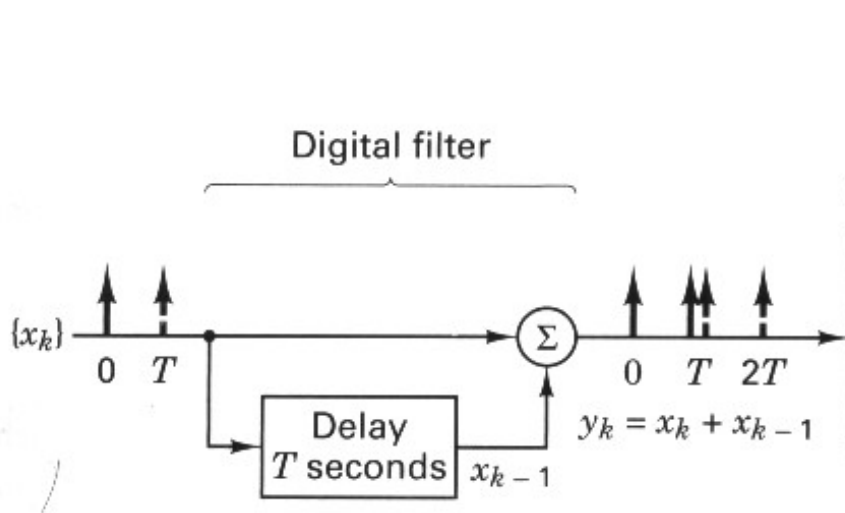
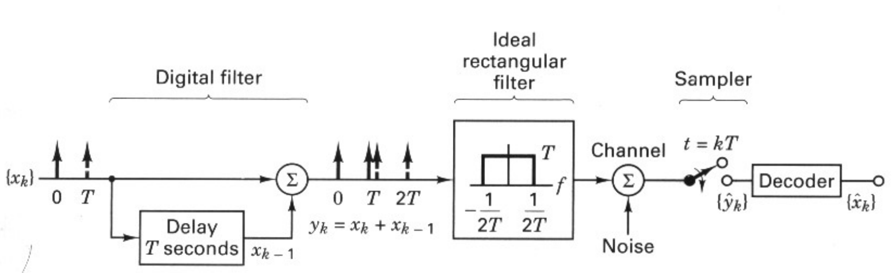
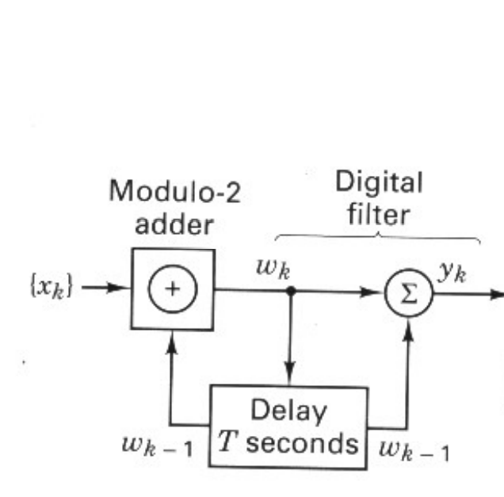
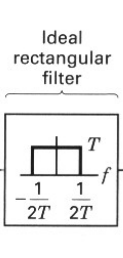

---
# MARP
marp: true
math: katex
paginate: true
backgroundColor: #fff
theme: marp-custom
# Jekyll
title: 2.9 Correlative Coding
description: ""
categories:
  - Digital Communications
toc: true
toc_sticky: true
tags:
  - [Sklar, Formatting and Baseband Modulation, Correlative Coding]
date: 2023-02-21
last_modified_at: 2023-02-21
published: true
---

The basic idea behind the duobinary technique

- introduce some controlled amount of ISI into the datastream
  - by introducing correlated interference between the pulses
  - canceled out the interference at the detector and achieved the ideal symbol-rate packing of 2 symbols/s/Hz

---

## 2.9.1 Duobinary Signaling

- how duobinary signaling introduces controlled ISI

---

### Digital filter

- for every pulse into the digital filter, we get the summation of two pulses out

$$y_k=x_k+x_{k-1}$$

---

### Receiver sampler

- recover the sequence $\{y_k\}$ in the absence of noise

---

### Notation

- $\{\hat{y}_k\}$: the received $\{y_k\}$ as the estimate of $\{y_k\}$
- $\{\hat{x}_k\}$: an estimate of $\{x_k\}$
  - from removing the controlled interference with the duobinary decoder

---

## 2.9.2 Duobinary Decoding

- Decoding procedure
  - subtract the $x_{k-1}$ decision from the $y_k$ digit
- advantage
  - the decision rule simply implements the subtraction of each $\hat{x}_{k-1}$ decision from each $\hat{y}_k$.
- drawback
  - once an error is made, it tends to propagate, causing further errors, since present decisions depend on prior decisions

---

## 2.9.3 Precoding

- a means of avoiding this error propagation

precoding is accomplished by first differentially encoding the $\{x_k\}$ binary sequence into a new $\{w_k\}$ binary sequnece

$$
w_k=x_k\oplus w_{k-1}
$$

---

- enables us to decode the $\{\hat{y}_k\}$ sequence by making a decision on each received sample simply, without resorting to prior decisions that could be in error
  - in the event of a digit error due to noise, such an error does not propagate to other digits

---

## 2.9.4 Duobinary Equivalent Transfer Function

- The frequency transfer function of the input digital filter

$$
H_1(f)=1+e^{-j2\pi fT}
$$

---

- The transfer funtion of the ideal rectangular filter

$$
H_2(f)=
\begin{cases}
\begin{split}
  T\quad&\text{for }|f|<{1\over{2T}}\\
  0\quad&\text{elsewhere}
\end{split}
\end{cases}
$$

---

- The duobinary equivalent transfer function: cosine filter

$$
|H_e(f)|=
\begin{cases}
\begin{split}
  2T\cos{\pi fT}\quad&\text{for }|f|<{1\over{2T}}\\
  0\quad&\text{elsewhere}
\end{split}
\end{cases}
$$

- The corresponding impulse response

$$
h_e(t)=\text{sinc}\left({t\over{T}}\right)+\text{sinc}\left({t-T\over{T}}\right)
$$

---

## 2.9.5 Comparison of Binary with Duobinary Signaling

- For a fixed amount of signal power
  - the ease of making reliable decisions is inversley related to the number of levels that must distinguished in each waveform
  - duobinary signaling accomplishes the zero ISI requirement with minimum bandwidth
  - duobinary signaling requires more power than binary signaling, for equivalent performance against noise
- For a given probability of bit error ($P_B$)
  - duobinary signaling requires approximately 2.5 dB greater SNR than binary signaling
  - while using only 1/(1+r) the bandwidth that binary signaling requires

---

## 2.9.6 Polybinary Signaling

Duobinary signaling can be extended to more than three digits or levels, resulting in greater bandwidth efficiency

$$
y_k=x_k \oplus y_{k-1} \oplus y_{k-2}\oplus y_{k-3}
$$

- the primary advantage
  - the redistribution of the spectral density of the original sequence $\{x_k\}$
  - so as to favor the low frequencies, thus improving system bandwidth efficiency
